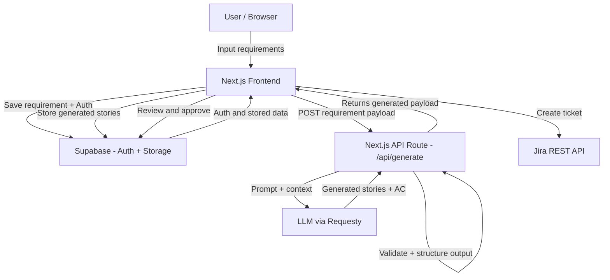
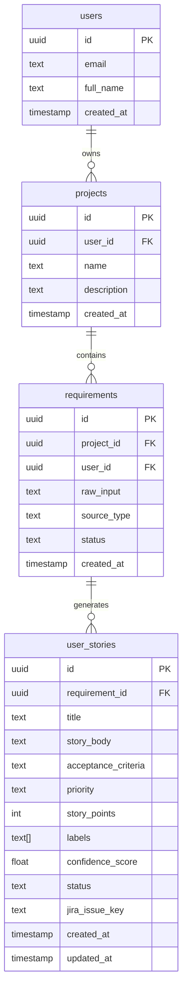
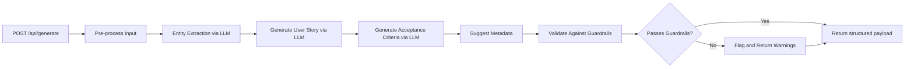
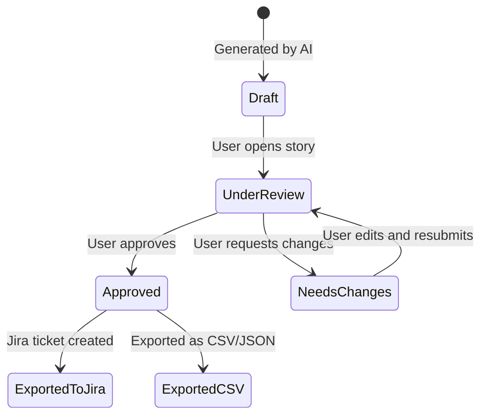
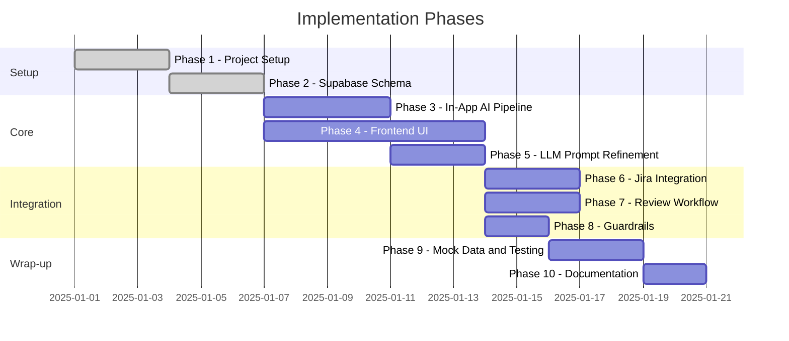

# AI User Story Generator – Implementation Plan

## Overview

This document outlines the step-by-step implementation plan for the **AI User Story Generator** — a proof-of-concept tool that converts unstructured business requirements into structured, Jira-ready user stories using AI.

---

## Technology Stack

| Layer | Technology |
|---|---|
| Frontend | Next.js + shadcn/ui |
| Backend / Database | Supabase (Postgres, Auth, Storage) |
| AI Orchestration | Next.js API Routes (server-side) |
| LLM Access | Requesty (or approved LLM tooling) |
| Jira Integration | Jira REST API |
| Language | TypeScript |

---

## System Architecture



---

## Phase 1 — Project Setup and Scaffolding

### Goals
- Initialize the Next.js project with TypeScript
- Configure shadcn/ui component library
- Set up ESLint, Prettier, and project conventions
- Create the GitHub repository with a clear README and setup instructions

### Tasks
1. Run `npx create-next-app@latest` with TypeScript and App Router enabled
2. Install and initialize `shadcn/ui` (`npx shadcn-ui@latest init`)
3. Install dependencies: `@supabase/supabase-js`, `@supabase/auth-helpers-nextjs`, `axios`, `zod`, `react-hook-form`
4. Create the folder structure:
   ```
   /app           → Next.js App Router pages
   /components    → Reusable UI components
   /lib           → Supabase client, API helpers
   /types         → TypeScript interfaces
   /prompts       → LLM prompt templates
   /plans         → This document
   ```
5. Configure environment variables (`.env.local.example`):
   ```
   NEXT_PUBLIC_SUPABASE_URL=
   NEXT_PUBLIC_SUPABASE_ANON_KEY=
   SUPABASE_SERVICE_ROLE_KEY=
   REQUESTY_API_KEY=
   REQUESTY_BASE_URL=
   REQUESTY_MODEL=
   JIRA_BASE_URL=
   JIRA_API_TOKEN=
   JIRA_EMAIL=
   JIRA_PROJECT_KEY=
   ```
6. Initialize GitHub repository with `.gitignore` and `README.md`

---

## Phase 2 — Supabase Schema and Auth

### Goals
- Provision a Supabase project
- Design the database schema
- Configure authentication

### Database Schema



### Tasks
1. Create a Supabase project and note the URL and keys
2. Write SQL migrations for each table above
3. Enable Row Level Security (RLS) on all tables — users can only access their own data
4. Configure Supabase Auth with email/password (and optionally Google OAuth)
5. Create Supabase Storage bucket for document uploads (if document upload feature is enabled)
6. Set up Supabase client in `/lib/supabase.ts`

---

## Phase 3 — In-App AI Processing Pipeline

### Goals
- Design the AI processing pipeline as a server-side Next.js API route
- Orchestrate multi-step LLM calls directly within the application layer
- Keep all persistence and auth context within the app

### Pipeline Steps



### Tasks
1. Delete `lib/n8n.ts` — this file is no longer needed
2. Create `lib/llm.ts` with a `callLLM(prompt, variables)` utility that calls Requesty directly using the OpenAI-compatible API
3. Create `lib/pipeline.ts` to orchestrate the multi-step AI pipeline:
   - `extractEntities(input)` — calls LLM with entity extraction prompt
   - `generateStory(entities)` — calls LLM with user story generation prompt
   - `generateAcceptanceCriteria(story)` — calls LLM with acceptance criteria prompt
   - `suggestMetadata(story)` — infers priority, story points, and labels
4. Implement variable interpolation for prompt templates using `/prompts/` files
5. Add response parsing and `zod` schema validation at each pipeline step
6. Implement in-app guardrails in `lib/guardrails.ts` (replaces the n8n Function node)
7. Create the `POST /api/generate` Next.js API route that:
   - Authenticates the request via Supabase session
   - Saves the raw requirement to Supabase
   - Runs the pipeline steps sequentially
   - Stores the returned generated stories in Supabase under the authenticated user
   - Returns the structured payload to the frontend

---

## Phase 4 — Frontend UI Implementation

### Goals
- Build the core pages and UI components using Next.js App Router and shadcn/ui

### Pages and Components

| Route | Purpose |
|---|---|
| `/` | Landing / dashboard — list of projects and recent requirements |
| `/projects/new` | Create a new project |
| `/projects/[id]` | Project detail — list of requirements and stories |
| `/requirements/new` | Requirement input form |
| `/requirements/[id]` | Side-by-side view: raw input vs generated stories |
| `/stories/[id]` | Individual user story editor and approval |

### Key Components
- `RequirementInput` — textarea + optional file upload
- `StoryCard` — displays generated user story, acceptance criteria, and metadata badges
- `SideBySideView` — raw input on the left, generated output on the right
- `MetadataBadges` — shows priority, story points, labels, and confidence indicator
- `ConfidenceIndicator` — visual signal for AI confidence per story
- `JiraExportButton` — triggers Jira ticket creation with dry-run support
- `ApprovalToolbar` — Approve / Request Changes / Reject actions

### Tasks
1. Build layout shell with navigation sidebar using shadcn `Sheet` and `NavigationMenu`
2. Implement Supabase Auth pages (login, signup) using `@supabase/auth-helpers-nextjs`
3. Build `RequirementInput` form with `react-hook-form` + `zod` validation
4. Wire the `RequirementInput` form to call `POST /api/generate` (implemented in Phase 3) and handle loading states during the multi-step LLM pipeline
5. Build the `SideBySideView` page using a two-column grid layout
6. Build the `StoryCard` component with inline editing support
7. Build the approval toolbar with status transitions

---

## Phase 5 — LLM Integration and Prompt Refinement

### Goals
- Refine and validate the prompts used in the in-app pipeline (Phase 3)
- Ensure reliable, structured LLM output with guardrails and fallback handling
- Use Requesty (or compatible OpenAI-compatible endpoint) for LLM calls

### Prompt Templates

Store all prompts as versioned templates in `/prompts/`.

#### Entity Extraction Prompt (`/prompts/entity-extraction.txt`)
```
You are a requirements analyst. Given the following unstructured business requirement, extract the key entities:
- Actor (who is performing the action)
- Goal (what they want to do)
- Value (why / the business benefit)

Only extract information explicitly stated in the input. If any entity is missing, return null for that field.

Input:
{{input}}

Respond in JSON format:
{
  "actor": "...",
  "goal": "...",
  "value": "...",
  "missing_fields": ["actor" | "goal" | "value"]
}
```

#### User Story Generation Prompt (`/prompts/user-story-generation.txt`)
```
You are a product analyst. Generate a Jira user story using the EXACTLY the following template:

"As a [actor], I want [goal], so that [value]."

Use ONLY the information provided below. Do NOT infer, assume, or add information not explicitly present.
If any field is missing, use the placeholder text: "[MISSING: field_name]" and flag it.

Entities:
{{entities}}

Also suggest:
- Priority: Low | Medium | High | Critical
- Story Points: 1 | 2 | 3 | 5 | 8 | 13
- Labels: (comma-separated relevant tags)
- Confidence: 0.0 to 1.0 (how confident you are this story accurately reflects the input)

Respond in JSON format.
```

#### Acceptance Criteria Prompt (`/prompts/acceptance-criteria.txt`)
```
You are a QA analyst. Given the user story below, generate acceptance criteria using the Given/When/Then format.

Rules:
- Each criterion must be testable and specific
- Only derive criteria from information explicitly in the story
- Generate between 2 and 5 criteria
- If the story is ambiguous, flag it

User Story:
{{story}}

Respond as a JSON array of objects: [{ "given": "...", "when": "...", "then": "..." }]
```

### Tasks
1. Review and iterate on prompt files in `/prompts/` — refine based on real LLM output observed during Phase 3 development
2. Add structured JSON mode / response format enforcement in LLM API calls where supported
3. Implement retry logic in `callLLM()` for transient LLM failures
4. Add response parsing and validation using `zod` schemas for each pipeline step
5. Log raw LLM responses to Supabase for traceability
6. Test each prompt in isolation with mock inputs to validate output structure

---

## Phase 6 — Jira REST API Integration

### Goals
- Allow approved user stories to be pushed directly to Jira as issues

### Field Mapping

| App Field | Jira Field |
|---|---|
| `title` | `summary` |
| `story_body` + `acceptance_criteria` | `description` |
| `priority` | `priority.name` |
| `labels` | `labels` |
| `story_points` | `story_points` (custom field) |

### Tasks
1. Create `/lib/jira.ts` with helper functions:
   - `createJiraIssue(story)` — calls `POST /rest/api/3/issue`
   - `getJiraProjects()` — fetches available projects for configuration
2. Implement a **dry-run mode**: preview the Jira payload without creating the ticket
3. Add a `POST /api/jira/create` Next.js API route
4. Store the returned `jira_issue_key` on the `user_stories` record in Supabase
5. Display a Jira link in the UI after successful creation
6. Handle Jira API errors gracefully (auth failures, field validation errors)

---

## Phase 7 — Review and Approval Workflow

### Goals
- Allow users to review, edit, and approve generated stories before export

### Story Status Flow



### Tasks
1. Add `status` enum to the `user_stories` table: `draft | under_review | approved | needs_changes | exported`
2. Build the `ApprovalToolbar` component with action buttons and status badge
3. Implement inline editing for story body, acceptance criteria, and metadata
4. Track edit history: log changes with timestamps to a `story_edits` table
5. Allow bulk approval of multiple stories from the project view
6. Add export to JSON and CSV options alongside Jira export

---

## Phase 8 — Guardrails and Safety Layer

### Goals
- Prevent hallucinated requirements and enforce structured output

### Guardrail Rules
1. **No invention rule** — LLM must only use information present in the input
2. **Missing field flagging** — if actor, goal, or value is missing, flag rather than guess
3. **Template enforcement** — story must match `"As a... I want... So that..."` pattern
4. **Testability check** — each acceptance criterion must include a verifiable outcome
5. **Confidence threshold** — stories with confidence below `0.6` are auto-flagged for review

### Tasks
1. Implement a `validateStory(story)` function in `/lib/guardrails.ts`
2. Add regex validation for story template format
3. Add confidence score threshold check — flag stories below 0.6
4. Display warning banners in the UI for flagged stories
5. Prevent Jira export for stories in `needs_changes` or `draft` status
6. Log all guardrail violations to a `guardrail_logs` table for analysis

---

## Phase 9 — Mock Data and Testing

### Goals
- Create a realistic mock dataset for development and demo purposes
- Validate the end-to-end flow

### Mock Dataset (`/mock-data/`)
Create 5–10 sample requirement inputs covering:
- Feature descriptions from meeting notes
- Email-style requirement descriptions
- Formal BRD-style paragraphs
- Ambiguous inputs (to test flagging behaviour)
- Multi-story inputs (to test story splitting)

### Tasks
1. Create `/mock-data/requirements.json` with sample inputs
2. Write a seed script to populate Supabase with mock data (`/scripts/seed.ts`)
3. Test the full pipeline end-to-end for each mock input
4. Validate output stories against guardrail rules
5. Test Jira dry-run mode for each approved story
6. Document observed issues and edge cases

---

## Phase 10 — Documentation and Deliverables

### Goals
- Produce all required deliverables per the project spec

### Tasks
1. **README.md** — setup instructions, environment variables, how to run locally
2. **`/plans/implementation-plan.md`** — this document (architecture, decisions, phased plan)
3. **`/docs/prompt-design.md`** — prompt engineering decisions, versioning approach, known limitations
4. **`/docs/jira-integration.md`** — Jira API setup, field mapping, dry-run mode
5. **`/docs/findings.md`** — to be completed post-experiment: what worked, what didn't, observations
6. **`/docs/guardrails.md`** — guardrail design rationale and effectiveness observations
7. **`/docs/pipeline.md`** — in-app AI pipeline design, step breakdown, error handling strategy
8. Screenshot or demo recording of the working prototype

---

## Implementation Sequence Summary



---

## Open Questions and Design Decisions

| Question | Decision / Notes |
|---|---|
| Why was n8n removed from the stack? | n8n introduced unnecessary infrastructure overhead for a PoC. The AI pipeline is simple enough to run directly as server-side Next.js API routes, which keeps the stack leaner and removes the need for a separate local service. |
| How should multi-story inputs be handled? | LLM identifies and splits multiple stories in a single pass |
| Should document upload be in v1 scope? | Optional — plain text input is the primary interface for the PoC |
| What happens when Jira API is unavailable? | Graceful error, story remains in Approved state for retry |
| How do we version prompts? | Prompt files are version-controlled in Git; breaking changes get new filenames |
| Should LLM calls be sequential or parallelised? | Sequential for the PoC — entity extraction must complete before story generation, and story generation before acceptance criteria. Parallelisation can be added later if latency becomes an issue. |
| How do we handle LLM failures mid-pipeline? | Each step returns a structured error that is surfaced to the user. Partial results are not persisted. The user can retry the full generation. |
